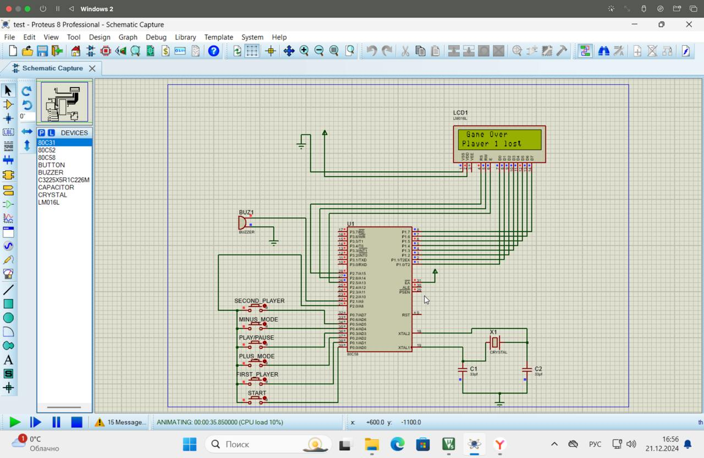

# Курсовая работа по Микроконтроллерным системам

## Тема: Шахматный часы

## Функционал
 - возможности установки лимита времени;
 - отображение времени при установке на жидкокристаллическом дисплее;
 - отображение оставшегося времени на жидкокристаллическом дисплее для каждого игрока;
 - попеременный отсчет времени для каждого игрока;
 - звуковая индикации об исчерпании лимита времени одним из игроков.

## Техническое исполнение
В схеме были использованы:
- 6 кнопок
- Микроконтроллер серии 8051
- Дисплей
- Зуммер

Для написания прошифки микроконтроллера был использован компилятор Keil 8051 for C. 
Прошивку можно найти по пути /code/Objects/test12.hex
Код прошивки - /code/test12.c

